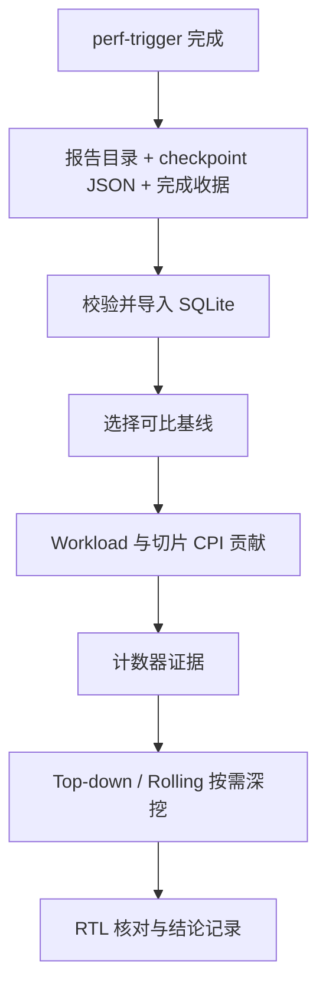

# 使用本仓库分析香山性能回归

本文对应 `feat/perf-regression-platform` 分支。目标是从一次已完成的 `perf-trigger` 运行出发，找到可比的基线，定位造成性能变化的 workload 和切片，再用计数器、Top-down 和 Rolling 缩小调查范围。所有命令都从本仓库根目录执行。

## 先理解数据流



仓库本身不运行 SPEC，也不保存完整的原始日志副本。`perf-trigger` 在 XiangShan 的 perf-report 目录生成 score、每个切片的 `simulator_out.txt` / `simulator_err.txt`；本仓库读取这些文件，保存结构化指标和源路径。需要能访问该目录的机器、包含实际测试提交的 XiangShan Git checkout，以及那次运行使用的 checkpoint profile JSON。

> **当前接入状态**：XiangShan 上游 `perf-template.yml` 尚未自动写完成收据。第一次使用时，应在确认运行结束、score 和切片日志完整后，手动写收据并导入。不要对正在写入或原地续跑的报告目录执行正式导入。

## 0. 准备路径和运行条件

以下变量只用于说明路径；将示例值替换为实际值：

```bash
export PERF_REPORT='/nfs/home/cirunner/perf-report/<已完成的run目录>'
export XS_REPO='/path/to/XiangShan'
export CKPT_JSON='/path/to/本次运行使用的/checkpoints_all.json'
export PERF_DB='/srv/perf/trend.sqlite'
```

`CKPT_JSON` 必须是本次工作流实际使用的 JSON。它的 `workload → points → checkpoint/weight` 定义了预期切片；不能拿另一次采样的文件替代。先记录实际 checkout 的 **40 位 SHA**、Actions run ID、`xs_config`、模拟器、benchmark 类型、warmup、测量指令数、最大周期数、CPU/DRAM 频率、DRAM 配置和构建选项。频率/DRAM 条件能在 `simulator_out.txt` 中读取时，导入器会和收据交叉核对。

## 1. 为完成的运行写收据

调用 `tools/write_perf_receipt.py --help` 查看全部参数。下例以 SPEC06 为例；`<...>` 都要填该次运行的**实际值**。工作流说明中的默认值只在确认该次运行没有覆盖参数后才能使用。

```bash
python3 tools/write_perf_receipt.py \
  --report-dir "$PERF_REPORT" \
  --checkpoint-list "$CKPT_JSON" \
  --score-file "$PERF_REPORT/score-spec06-rva23-novec-gcc16-1.0c.txt" \
  --commit-sha '<实际40位SHA>' \
  --actions-run-id '<Actions run ID>' \
  --branch-label kunminghu-v3 \
  --config DefaultConfig \
  --emulator gsim \
  --benchmark-type spec06-rva23-novec-gcc16-1.0c \
  --checkpoint-identity '<checkpoint映像集版本或路径>' \
  --warmup '<实际warmup指令数>' \
  --max-instr '<实际ROI指令数>' \
  --max-cycles '<实际上限或unlimited>' \
  --dram-config '<实际DRAM配置>' \
  --cpu-frequency-mhz '<实际CPU频率>' \
  --dram-frequency-mhz '<实际DRAM频率>' \
  --build-options '<影响性能口径的构建选项>' \
  --score-formula-version score-spec06/published-v1 \
  --output "$PERF_REPORT/.perf-platform-receipt.json"
```

自定义 benchmark 没有 score 时省略 `--score-file`，并给 `--score-formula-version` 一个明确值（例如 `none`）。当前 score 解析器只识别 SPEC06 格式；其他套装可导入切片 CPI，套装 score 需另写解析适配。

收据与源文件应对应同一已完成快照。**不要把不同参数写成相同值以求通过比较**：基线选择依赖这些条件。若报告目录会被后续运行复用，保留独立快照或确保在被覆盖前完成导入并保存需要追溯的原始证据。

## 2. 先校验，再入库

```bash
python3 tools/ingest_perf_run.py \
  --receipt "$PERF_REPORT/.perf-platform-receipt.json" \
  --git-repo "$XS_REPO" --db "$PERF_DB" \
  --manifest-out /srv/perf/manifests/<run名>.json \
  --validate-only

python3 tools/ingest_perf_run.py \
  --receipt "$PERF_REPORT/.perf-platform-receipt.json" \
  --git-repo "$XS_REPO" --db "$PERF_DB"
```

第一条命令不写数据库，返回 `run_id`、`run_status` 和切片数量。检查生成的 manifest：预期切片数是否合理，配置与 SHA 是否正确，缺失切片是否标为 `missing`。第二条命令事务性写入数据库；同一快照重试使用相同 `run_id`。源文件变化会得到另一个快照 ID，不能把它误认为同一份不可变运行。

常见 `run_status`：

| 状态 | 意义 | 正式 A/B |
| --- | --- | --- |
| `published` | 收据完成，预期切片都有有效 ROI，score 未因后续切片更新而过期 | 可进入可比性检查 |
| `partial` | 某些预期切片缺失或解析失败 | 不作为严格比较基线 |
| `stale` | score 比已更新的切片结果更旧 | 不作为严格比较基线 |

若计划长期自动导入，在 CI 完成时写收据，然后定期执行：

```bash
python3 tools/ingest_completed_runs.py \
  --report-root /nfs/home/cirunner/perf-report \
  --git-repo "$XS_REPO" --db "$PERF_DB"
```

这个轮询器只扫描一级 run 子目录中的 `.perf-platform-receipt.json`，跳过已导入快照，并报告每个失败收据。当前 CI 尚未接入写收据步骤，因此部署轮询器本身不会自动产生新运行。

## 3. 选择基线，先看总体和切片

启动数据库看板：

```bash
python3 tools/serve_perf_platform.py \
  --db "$PERF_DB" --git-repo "$XS_REPO" --host 127.0.0.1 --port 8000
```

访问 `http://127.0.0.1:8000/`。选择目标 run 后，页面会在**同一 comparison key、同一切片集**中寻找目标提交第一父链上最近、已测试且 `published` 的祖先作为基线；也可以手选 A/B。如果找不到，不会拿运行时间最接近的分支数据自动充当基线。页面显示 workload 覆盖率、加权 CPI 差、切片贡献以及两边日志路径。

命令行可以复现同一分析：

```bash
python3 tools/query_demo.py --db "$PERF_DB" \
  compare --a '<base-run-id>' --b '<target-run-id>' --object mcf

python3 tools/query_demo.py --db "$PERF_DB" \
  trend --level workload --object mcf --metric equivalent_ipc
```

理解排序时使用以下等式：

```text
切片 CPI = ROI cycles / ROI instructions
完整 workload 的加权 CPI = Σ(切片权重 × 切片 CPI)
切片对 A→B 变化的贡献 = 权重 × (CPI_B − CPI_A)
各切片贡献之和 = workload 加权 CPI_B − 加权 CPI_A
```

正贡献表示 CPI 退化。先看**贡献最大**的切片，而不是仅看 IPC 百分比跌幅最大者；还应检查改善切片是否抵消了退化。`0.3c` 等部分覆盖切片集可以做共同子集诊断，但正式完整 workload CPI 显示为 N/A，不能把选中切片重归一化后的结果称为完整 workload 结果。套装 score 是另一个聚合口径，不能把 `权重 × ΔCPI` 当作切片对 SPEC score 的精确贡献。

## 4. 为重点切片导入计数器并获取线索

默认首次导入不读巨大的 `[PERF]` 日志。确定 A/B run 后，对两边分别补导注册指标：

```bash
python3 tools/ingest_perf_run.py --receipt '<A的收据>' \
  --git-repo "$XS_REPO" --db "$PERF_DB" --counters
python3 tools/ingest_perf_run.py --receipt '<B的收据>' \
  --git-repo "$XS_REPO" --db "$PERF_DB" --counters

python3 tools/diagnose_perf_pair.py --db "$PERF_DB" \
  --a '<base-run-id>' --b '<target-run-id>' \
  --workload mcf --top 5 \
  --output /srv/perf/cases/mcf/diagnosis.json
```

指标白名单在 `commit_ipc_trend/metric_registry.json`。`diagnosis.json` 给出正贡献切片、可比计数器的 A/B 原始值与差值，以及在多个退化切片同向变化的指标。只有 `available`、相同语义版本且同为同一 `window_id` 的两边数据才配对。**同向变化只是调查线索**：还需查看该 counter 的 RTL 递增条件、是否计重、统计窗口和反证指标。缺失值不能填零；不能拿 `perf_final_dump` 的计数除以另一个 `roi_summary` 窗口的指令数。

例如看到 TLB/PTW 事件减少而访存请求增加时，应同时检查 ROB 头等待、MSHR 生命周期、队列占满和预取仲裁等证据，再决定是否存在下游争用。不要仅凭“请求增加”断言 LLC 或 DRAM 饱和。

## 5. 按需调用 Top-down

当切片贡献已经指出重点 workload，但计数器尚未区分前端、后端和访存问题时，调用 XiangShan 原有的 `scripts/top-down/top_down.py`：

```bash
python3 tools/analyze_perf_pair.py --db "$PERF_DB" \
  --a '<base-run-id>' --b '<target-run-id>' --workload mcf \
  --xiangshan "$XS_REPO" --output-dir /srv/perf/analyses \
  topdown --checkpoint-json "$CKPT_JSON" \
  --base-issue '<A的issue width>' --target-issue '<B的issue width>'
```

包装器先做 A/B 可比性检查，再在独立输出目录执行上游脚本，保存 `analysis.json`、stdout/stderr、Top-down CSV 和图片，并在数据库 `analysis_runs` 表登记路径及工具 SHA。上游脚本分析的是**传入的完整报告目录与 JSON**，`--workload mcf` 用于包装器的可比性检查和记录，不会自动过滤 Top-down 输出；读取 CSV 时需定位目标 workload。对照 `results_base.csv`、`results_ref.csv` 的逐采样点数据及 `results-weighted_*.csv` 的加权结果；核对 `configs.py` 的 counter 映射。分类比例变化不等于对应的绝对等待周期变化。

## 6. 有 Rolling DB 时定位发生阶段

只有该次运行开启并保留了 ChiselDB/rolling dump，才能执行下列步骤。先用 XiangShan `rolling.py list` 查确认具体 DB、hart 和 counter，然后在平台调用叠加：

```bash
python3 "$XS_REPO/scripts/rolling.py" list '<A的rolling.db>' --hart 0
python3 "$XS_REPO/scripts/rolling.py" list '<B的rolling.db>' --hart 0

python3 tools/analyze_perf_pair.py --db "$PERF_DB" \
  --a '<base-run-id>' --b '<target-run-id>' --workload mcf \
  --xiangshan "$XS_REPO" --output-dir /srv/perf/analyses \
  rolling --base-db '<A的rolling.db>' --target-db '<B的rolling.db>' \
  --perf-name ipc --hart 0
```

包装器保存叠加图及分析记录。两条曲线重合的横坐标不自动意味着“同一个程序阶段”；跨 ELF、不同长度或循环展开时，需要程序锚点验证阶段对应关系。只有聚合计数器而没有 rolling DB 时，回到切片级 A/B 分析，并在必要时定点复跑；无法从聚合数据恢复时间线。

## 7. 整理可复查的分析结论

一次调查建议保存以下内容：

1. A/B run ID、完整 SHA、Actions URL、比较条件和状态；若不可比，明确给出原因。
2. score/workload 变化、覆盖率、正负切片贡献与贡献和式校验。
3. 关键 counter 的完整名称、源路径、单位、统计窗口、原始 A/B 值以及 RTL 递增条件。
4. Top-down 原始/加权 CSV 路径、脚本与配置版本；有 Rolling 时记录 DB 路径、hart、counter 与对齐方式。
5. 将**直接观测、可能解释、反证、最小下一步验证**分开；不要把相关性或单 seed 变化写成已经证明的因果结论。

想把结构化结果交给 AI 继续调查时，先提供本仓库的 manifest、A/B 比较 JSON、`diagnosis.json` 和相关 CSV，再附上原始日志路径与 RTL counter 定义。提示词应要求 AI 对每个数字标注来源，并保留数据缺失和可比性限制。

## 常见阻塞

| 现象 | 检查位置 |
| --- | --- |
| `missing comparison conditions` | 收据中的 `experiment` 必需字段及实际工作流默认值 |
| `cannot resolve Git commit` | `--git-repo` 是否包含测试的完整 SHA |
| `checkpoint weights ... expected <= 1` | JSON/列表是否为该次使用的切片集，是否混入重复 workload |
| `partial` | manifest 的 `slice_results.status/error_code` 和源目录是否缺日志 |
| `stale` | score 生成时间是否早于切片日志最后更新；是否发生原地续跑 |
| `comparison_key_mismatch` | 配置、checkpoint、窗口、模拟器、构建选项和 DRAM 条件 |
| 没有计数器配对 | 两边是否用 `--counters` 导入，注册表是否覆盖目标指标，版本/窗口是否一致 |
| Top-down 或 Rolling 失败 | 输出目录的 `stderr.txt`、上游脚本依赖、checkpoint JSON 或 DB 路径 |

部署说明、接口列表及已知限制见 [perf-platform.md](perf-platform.md)。
